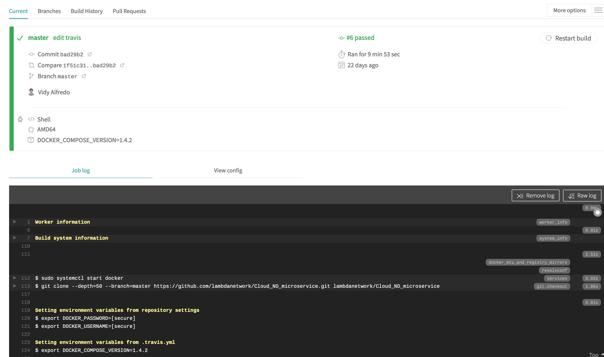

# Udagram Image Filtering Application

Udagram is a simple cloud application developed alongside the Udacity Cloud Engineering Nanodegree. It allows users to register and log into a web client, post photos to the feed, and process photos using an image filtering microservice.

The project is split into two parts:
1. Frontend - Angular web application built with Ionic Framework
2. Backend RESTful API - Node-Express application

# How to Run
### Docker images
1. `cd udagram-deployment/docker`
2. Build the images: `docker-compose -f docker-compose-build.yaml build --parallel`
3. Push the images: `docker-compose -f docker-compose-build.yaml push`
4. Run the containers: `docker-compose up`

### kubernetes
3. `cd udagram-deployment/k8s`
4. `kubectl apply -f .`

# Travis 
1. setup travis ci/cd

# Service Orchestration with Kubernetes

A screenshots of kubectl commands show the Frontend and API projects deployed in Kubernetes. 

The output of kubectl get pods indicates that the pods are running successfully with the STATUS value Running.

The output of kubectl describe services does not expose any sensitive strings such as database passwords.